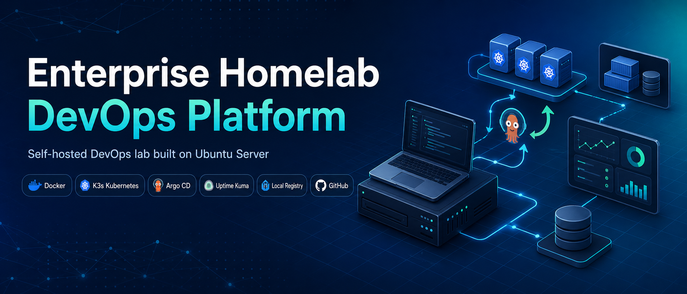
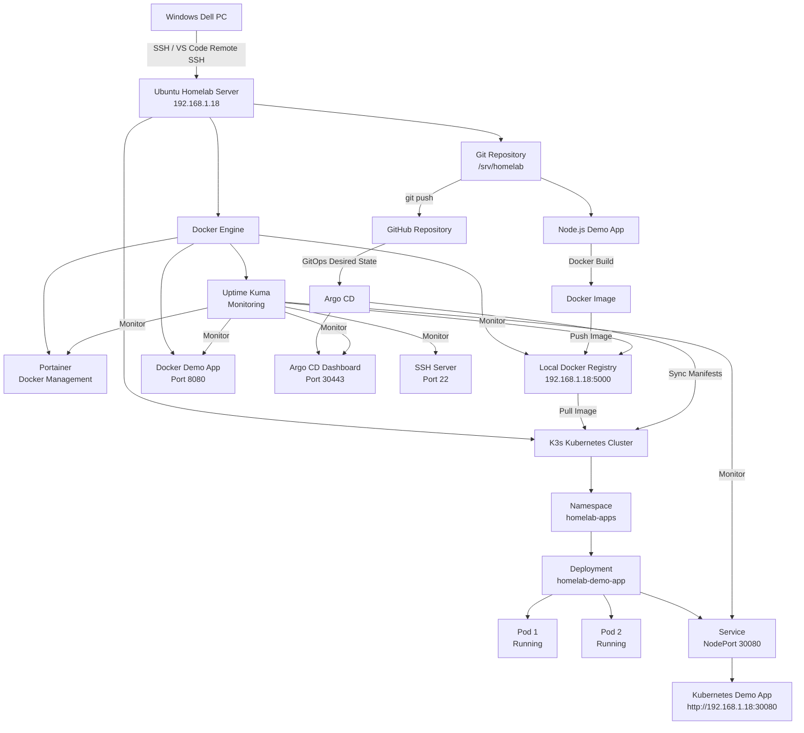
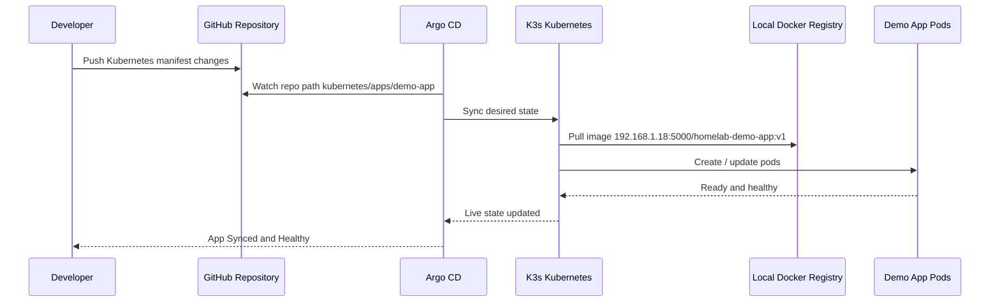
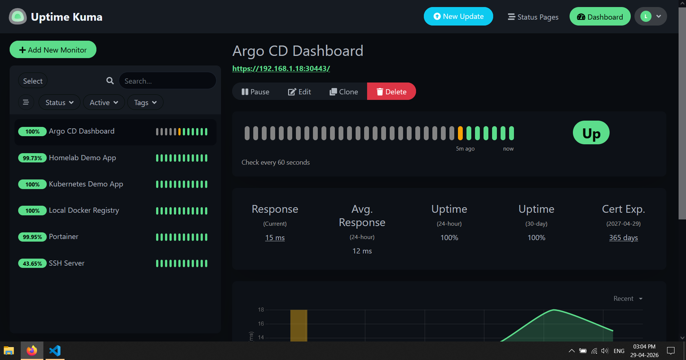
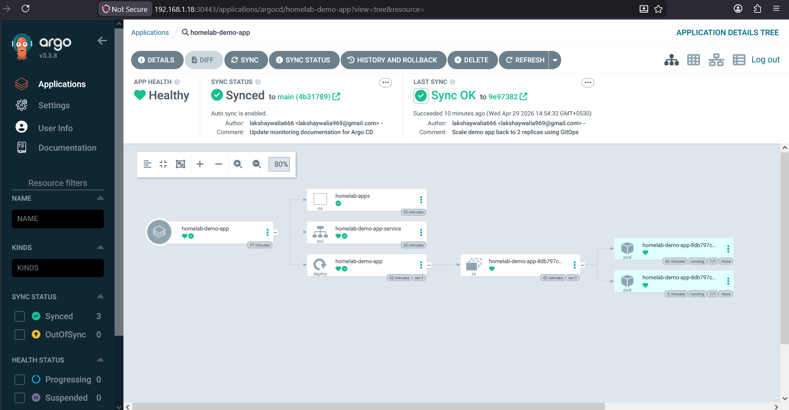
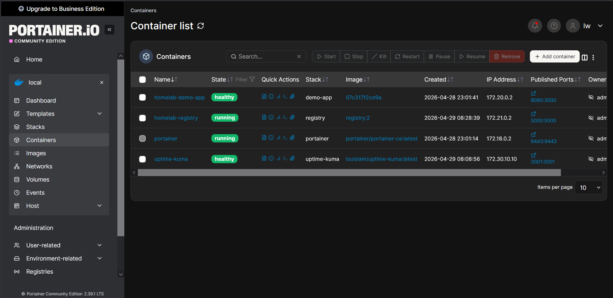

<div align="center">

# Enterprise Homelab DevOps Platform

### Self-hosted DevOps platform built on Ubuntu Server using Docker, K3s Kubernetes, Argo CD, GitOps, Local Registry, and Uptime Kuma



<br/>


</div>

---

## Overview

The **Enterprise Homelab DevOps Platform** is a self-hosted DevOps environment built on an old Gateway laptop server running **Ubuntu Server 24.04 LTS**.

This project simulates a real-world DevOps platform where code, containers, Kubernetes, monitoring, and GitOps workflows are managed from a structured homelab environment.

The goal of this project is to demonstrate practical skills in:

- Linux server administration
- Docker and Docker Compose
- Local Docker Registry
- K3s Kubernetes
- Kubernetes deployments and scaling
- Argo CD GitOps
- Uptime monitoring
- GitHub-based version control
- Remote development using VS Code SSH
- Documentation-first DevOps practice

---

## Why I Built This

Most beginner DevOps projects only deploy a simple app.

This project goes further by building a small but realistic platform that includes:

- A structured server workspace
- Dockerized services
- A private local image registry
- Kubernetes deployment using K3s
- GitOps deployment using Argo CD
- Uptime monitoring using Uptime Kuma
- Reboot survival testing
- Kubernetes scaling tests
- GitOps scaling tests
- Repeatable operational scripts
- Professional documentation

This makes the project closer to how real infrastructure is planned, deployed, monitored, and maintained.

---

## High-Level Architecture

```text
Windows Dell PC
    |
    | SSH / VS Code Remote SSH
    v
Ubuntu Homelab Server
192.168.1.18
    |
    | Docker + Docker Compose
    v
Local Services
    |-- Portainer
    |-- Uptime Kuma
    |-- Local Docker Registry
    |-- Docker Demo App
    |
    | Image Push / Pull
    v
K3s Kubernetes Cluster
    |
    | GitOps Sync
    v
Argo CD
    |
    | Watches GitHub Repository
    v
Kubernetes Demo App
```
---

## Platform Flowchart


## GitOps Deployment Flow


---
---

## Hardware Used

| Component | Details |
|---|---|
| Server | Old Gateway laptop |
| CPU | Intel i5 10th Gen |
| RAM | 16 GB |
| Storage | 2 TB external drive |
| Server OS | Ubuntu Server 24.04 LTS |
| Server IP | 192.168.1.18 |
| Primary Machine | Dell Windows PC |

---

## Tech Stack

| Area | Tools |
|---|---|
| Operating System | Ubuntu Server 24.04 LTS |
| Remote Access | SSH, VS Code Remote SSH |
| Version Control | Git, GitHub |
| Containers | Docker, Docker Compose |
| Container Management | Portainer |
| Container Registry | Local Docker Registry |
| Kubernetes | K3s |
| GitOps | Argo CD |
| Monitoring | Uptime Kuma |
| Application Runtime | Node.js |
| Firewall | UFW |
| Documentation | Markdown |

---

## Current Services

> These URLs are available inside my local network.

| Service | URL | Purpose |
|---|---|---|
| Portainer | `https://192.168.1.18:9443` | Docker management dashboard |
| Uptime Kuma | `http://192.168.1.18:3001` | Uptime monitoring dashboard |
| Local Docker Registry | `http://192.168.1.18:5000` | Local image registry |
| Docker Demo App | `http://192.168.1.18:8080` | Docker Compose demo app |
| Kubernetes Demo App | `http://192.168.1.18:30080` | App deployed on K3s |
| Argo CD | `https://192.168.1.18:30443` | GitOps dashboard |

---

## Screenshots

### Uptime Kuma Monitoring Dashboard



---

### Argo CD GitOps Dashboard



---

### Portainer Docker Dashboard



---


## Project Structure

```text
/srv/homelab
├── backups/
├── data/
│   ├── grafana/
│   ├── loki/
│   ├── portainer/
│   ├── postgres/
│   ├── prometheus/
│   ├── redis/
│   ├── registry/
│   └── uptime-kuma/
├── docker/
│   ├── nginx-proxy/
│   ├── portainer/
│   ├── registry/
│   └── uptime-kuma/
├── docs/
│   ├── assets/
│   ├── screenshots/
│   ├── architecture.md
│   ├── argocd-gitops-scaling-test.md
│   ├── argocd-installation.md
│   ├── k3s-installation.md
│   ├── kubernetes-checkpoint.md
│   ├── kubernetes-demo-app.md
│   ├── kubernetes-scaling-test.md
│   ├── kubernetes-scripts.md
│   ├── local-registry.md
│   ├── monitoring.md
│   ├── reboot-test.md
│   └── service-catalog.md
├── infra/
│   ├── ansible/
│   └── terraform/
├── kubernetes/
│   ├── apps/
│   │   └── demo-app/
│   ├── argocd/
│   │   └── apps/
│   ├── ingress/
│   ├── k3s/
│   ├── monitoring/
│   └── secrets/
├── logs/
├── projects/
│   ├── demo-app/
│   └── microservices-app/
├── scripts/
├── secrets/
└── README.md
```

---

## DevOps Workflow

The current workflow is:

```text
Developer updates application or Kubernetes manifest
        |
        v
Git commit and push to GitHub
        |
        v
Docker image is built
        |
        v
Image is pushed to local Docker Registry
        |
        v
Argo CD watches GitHub
        |
        v
Argo CD syncs desired state to K3s
        |
        v
Kubernetes runs the application pods
        |
        v
Uptime Kuma monitors health
```

---

## Docker Layer

Docker is used to run core platform services.

| Service | Location | Purpose |
|---|---|---|
| Portainer | `docker/portainer` | Docker management |
| Uptime Kuma | `docker/uptime-kuma` | Monitoring |
| Local Registry | `docker/registry` | Store Docker images |
| Demo App | `projects/demo-app` | Sample Node.js app |

---

## Local Docker Registry

A private local registry is running at:

```text
192.168.1.18:5000
```

Example image:

```text
192.168.1.18:5000/homelab-demo-app:v1
```

Check registry health:

```bash
curl http://192.168.1.18:5000/v2/
```

Check registry catalog:

```bash
curl http://192.168.1.18:5000/v2/_catalog
```

Expected output:

```json
{"repositories":["homelab-demo-app"]}
```

---

## K3s Kubernetes

K3s is installed as a single-node Kubernetes cluster.

| Item | Value |
|---|---|
| Distribution | K3s |
| Node | gateway-home-server |
| Node IP | 192.168.1.18 |
| Runtime | containerd |
| Role | control-plane |
| Status | Ready |

Check cluster:

```bash
kubectl get nodes -o wide
```

Check pods:

```bash
kubectl get pods -A
```

Check metrics:

```bash
kubectl top nodes
kubectl top pods -A
```

---

## Kubernetes Demo App

The demo app is deployed to K3s using Kubernetes manifests.

| Item | Value |
|---|---|
| Namespace | homelab-apps |
| Deployment | homelab-demo-app |
| Replicas | 2 |
| Image | 192.168.1.18:5000/homelab-demo-app:v1 |
| Service Type | NodePort |
| NodePort | 30080 |
| Health URL | http://192.168.1.18:30080/health |

Check app:

```bash
kubectl get all -n homelab-apps
```

Health check:

```bash
curl http://192.168.1.18:30080/health
```

---

## Argo CD GitOps

Argo CD is used to manage the Kubernetes demo app from GitHub.

| Item | Value |
|---|---|
| Argo CD URL | https://192.168.1.18:30443 |
| Argo CD App | homelab-demo-app |
| Git Repo | enterprise-homelab-devops-platform |
| Git Path | kubernetes/apps/demo-app |
| Target Namespace | homelab-apps |
| Status | Synced and Healthy |

Check Argo CD application:

```bash
kubectl get applications -n argocd
```

Expected:

```text
homelab-demo-app   Synced   Healthy
```

---

## GitOps Scaling Test

A GitOps scaling test was completed using Argo CD.

### Scale Up

Changed in Git:

```yaml
replicas: 2
```

to:

```yaml
replicas: 3
```

Then:

```bash
git add kubernetes/apps/demo-app/deployment.yaml
git commit -m "Scale demo app to 3 replicas using GitOps"
git push
```

Result:

```text
Argo CD: Synced and Healthy
Deployment: 3/3 Ready
Pods: 3 Running
```

### Scale Down

Changed in Git:

```yaml
replicas: 3
```

to:

```yaml
replicas: 2
```

Result:

```text
Argo CD: Synced and Healthy
Deployment: 2/2 Ready
Pods: 2 Running
```

---

## Monitoring

Uptime Kuma monitors the platform.

Current monitored services:

| Monitor | Target |
|---|---|
| Docker Demo App | `http://192.168.1.18:8080/health` |
| Kubernetes Demo App | `http://192.168.1.18:30080/health` |
| Local Docker Registry | `http://192.168.1.18:5000/v2/` |
| Portainer | `https://192.168.1.18:9443` |
| SSH Server | `192.168.1.18:22` |
| Argo CD Dashboard | `https://192.168.1.18:30443` |

Dashboard:

```text
http://192.168.1.18:3001
```

---

## Important Scripts

| Script | Purpose |
|---|---|
| `scripts/status.sh` | Show server, disk, memory, Docker containers, and listening ports |
| `scripts/start-services.sh` | Start Docker services |
| `scripts/stop-services.sh` | Stop Docker services |
| `scripts/build-demo-app.sh` | Build and push demo app image to local registry |
| `scripts/k8s-status.sh` | Show Kubernetes cluster, pods, services, metrics, and health |
| `scripts/deploy-demo-k8s.sh` | Deploy demo app to K3s |
| `scripts/delete-demo-k8s.sh` | Delete demo app from K3s |

Run server status:

```bash
/srv/homelab/scripts/status.sh
```

Run Kubernetes status:

```bash
/srv/homelab/scripts/k8s-status.sh
```

Build and push app image:

```bash
/srv/homelab/scripts/build-demo-app.sh
```

Deploy Kubernetes app:

```bash
/srv/homelab/scripts/deploy-demo-k8s.sh
```

---

## Firewall Rules

The server uses UFW and allows access only from the local network.

| Port | Purpose |
|---:|---|
| 22 | SSH |
| 9443 | Portainer |
| 5000 | Local Docker Registry |
| 8080 | Docker Demo App |
| 3001 | Uptime Kuma |
| 6443 | Kubernetes API |
| 30080 | Kubernetes Demo App |
| 30088 | Argo CD HTTP |
| 30443 | Argo CD HTTPS |

Check firewall:

```bash
sudo ufw status numbered
```

---

## Reboot Survival

A reboot survival test was completed.

After reboot:

```text
Docker restarted automatically
Portainer restarted
Uptime Kuma restarted
Local Docker Registry restarted
Demo app restarted
K3s remained available
Argo CD remained available
Kubernetes app remained healthy
```

---

## Documentation

Detailed documentation is available in the `docs/` folder.

| Document | Description |
|---|---|
| `docs/architecture.md` | Full architecture overview |
| `docs/service-catalog.md` | Running services and ports |
| `docs/reboot-test.md` | Reboot survival test |
| `docs/local-registry.md` | Local Docker Registry setup |
| `docs/k3s-installation.md` | K3s installation |
| `docs/kubernetes-checkpoint.md` | Kubernetes checkpoint |
| `docs/kubernetes-demo-app.md` | Demo app deployment |
| `docs/kubernetes-scripts.md` | Kubernetes helper scripts |
| `docs/kubernetes-scaling-test.md` | Manual scaling test |
| `docs/argocd-installation.md` | Argo CD setup |
| `docs/argocd-gitops-scaling-test.md` | GitOps scaling test |
| `docs/monitoring.md` | Monitoring setup |

---

## Completed Milestones

- [x] Ubuntu Server setup
- [x] Static IP configured
- [x] SSH shortcut from Windows
- [x] SSH key-based login
- [x] VS Code Remote SSH workflow
- [x] Homelab folder structure
- [x] GitHub repository setup
- [x] Docker installation
- [x] Portainer deployment
- [x] Dockerized Node.js demo app
- [x] Docker healthcheck
- [x] Uptime Kuma monitoring
- [x] Local Docker Registry
- [x] Docker image pushed to local registry
- [x] K3s Kubernetes installation
- [x] K3s connected to local registry
- [x] Demo app deployed to K3s
- [x] Kubernetes metrics working
- [x] Manual Kubernetes scaling test
- [x] Argo CD installation
- [x] Argo CD dashboard exposed
- [x] Argo CD application created
- [x] GitOps-based deployment
- [x] GitOps-based scale up / scale down test
- [x] Architecture documentation
- [x] Monitoring documentation

---

## Next Improvements

Planned improvements:

- Helm chart for demo app
- NGINX Ingress Controller
- MetalLB
- Prometheus and Grafana
- Loki centralized logging
- Trivy image scanning
- GitHub Actions or GitLab CI/CD
- Ansible automation
- Terraform modules
- Backup automation
- Alert notifications

---

## What This Project Demonstrates

This project demonstrates hands-on knowledge of:

- Linux server administration
- SSH and remote development
- Docker and Docker Compose
- Container registry workflow
- Kubernetes deployment
- Kubernetes scaling
- Kubernetes metrics
- GitOps with Argo CD
- Uptime monitoring
- Firewall configuration
- Infrastructure documentation
- Operational scripting
- Real-world DevOps workflow thinking

---

## Author

**Lakshay Walia**

- LinkedIn: [linkedin.com/in/lakshaywalia18](https://www.linkedin.com/in/lakshaywalia18)
- GitHub: [github.com/lakshaywalia666](https://github.com/lakshaywalia666)

---

## Final Note

This project was built on limited home hardware to simulate how real DevOps platforms are structured, deployed, monitored, and maintained.

It shows that even with an old laptop server, it is possible to build a practical DevOps environment using modern tools like Docker, Kubernetes, Argo CD, and GitOps.
